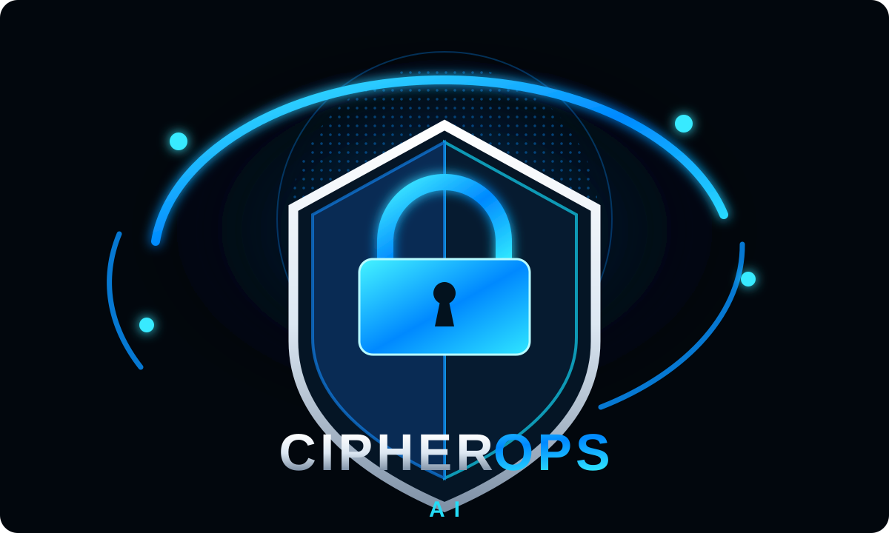
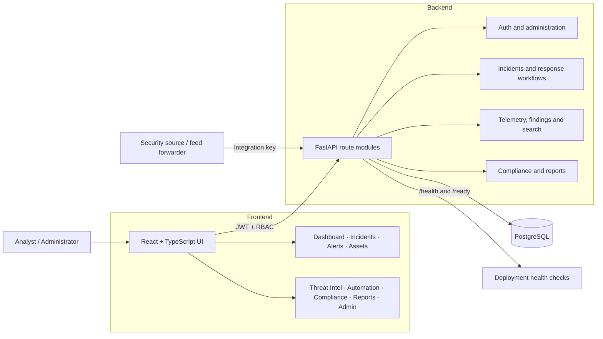

<p align="center">
  
</p>

<p align="center">
  <strong>Security operations workspace for alert triage, investigation, telemetry and governance.</strong>
</p>

<p align="center">
  <a href="https://github.com/haroondhanyal/Cipherops-Ai">GitHub repository</a> ·
  <a href="./backend/README.md">API and operations guide</a> ·
  <a href="./docs_DEVELOPMENT.md">Developer ownership and request flow</a>
</p>

# CipherOps AI

CipherOps AI is a full-stack security operations center (SOC) workspace. The frontend is built with React, TypeScript and Vite. The API uses FastAPI, SQLAlchemy and PostgreSQL, with Alembic migrations. The product covers six implementation phases, from identity and incident operations through telemetry, response workflows and governance.

> **Deployment note:** the repository provides source-neutral integration APIs and optional OpenID Connect (OIDC). Production use still needs organization-owned identity-provider configuration, live security-source collectors, deployment secrets and infrastructure controls.

## Contents

- [What is included](#what-is-included)
- [Architecture](#architecture)
- [Quick start](#quick-start)
- [Configuration](#configuration)
- [Main workflows](#main-workflows)
- [API overview](#api-overview)
- [Security and operational boundaries](#security-and-operational-boundaries)
- [Development checks](#development-checks)
- [Roadmap status](#roadmap-status)
- [Project documentation](#project-documentation)

## What is included

| Area | Capabilities |
| --- | --- |
| SOC dashboard | Database-backed metrics, 24-hour telemetry chart, source-coordinate map, priority incidents, deterministic signal summary and CSV export |
| Incident response | Search, severity/status/owner updates, activity timeline, analyst notes, evidence references and SHA-256 digests |
| Alerts | Persistent alert triage, assignment, status updates and promotion into incidents |
| Telemetry and assets | Integration-key ingestion, event deduplication, detection alerts, asset upsert and searchable inventory |
| Security findings | Cloud, identity, vulnerability, AI-agent and threat-intelligence finding queues with filtering and triage |
| Threat intelligence | IOC indicators, exact-value matching against telemetry and matched-indicator context on alerts |
| Response workflows | Separate-operator approval gates, manual playbook checklists and cross-incident automation history |
| Governance | Compliance controls and evidence, point-in-time report snapshots and CSV downloads |
| Identity and access | JWT sessions, role-based access control (RBAC), optional TOTP MFA and optional OIDC SSO |
| Operations | Audit history, API liveness/readiness endpoints, baseline security response headers and role-aware global search |

The app shell and page modules are separate from shared API helpers. The backend is organized into route modules. Seven workstreams and shared-contract rules are documented in [docs_DEVELOPMENT.md](./docs_DEVELOPMENT.md).

## Architecture



**Frontend:** `src/App.tsx` owns session restoration, navigation, global search and the shared shell. Page-specific flows live under `src/pages/`; reusable UI and API types/helpers live in `src/components/` and `src/shared.ts`.

**Backend:** `backend/app/main.py` configures FastAPI and composes routers from `backend/app/routers/`. SQLAlchemy models and Pydantic schemas define persisted data and request contracts. Alembic migrations are under `backend/alembic/versions/`.

**Persistence:** users, roles, permissions, audit records, alerts, incidents, assets, telemetry, findings, evidence, response records, compliance controls and report snapshots are stored in PostgreSQL. Demo records are fictional and only loaded by the explicit seeding command.

## Quick start

### Requirements

- Node.js 22.13 or newer (see [`.nvmrc`](./.nvmrc))
- Python 3.11 or newer and pip
- Docker Compose for the local PostgreSQL service, or a compatible PostgreSQL instance

### 1. Configure and start PostgreSQL

From the repository root:

```sh
cp .env.example .env
```

Edit `.env` and replace `POSTGRES_PASSWORD` with a private local password. Then start the database:

```sh
docker compose up -d postgres
```

### 2. Configure and start the API

```sh
cd backend
cp .env.example .env
```

Edit `backend/.env`: set `DATABASE_URL` to use the same PostgreSQL password as the root `.env`, and replace `JWT_SECRET` with a random secret of at least 32 characters. Then install dependencies, migrate and start the API:

```sh
python -m venv .venv
source .venv/bin/activate
pip install -r requirements.txt
alembic upgrade head
uvicorn app.main:app --reload
```

The API is available at `http://localhost:8000`; interactive OpenAPI docs are at `http://localhost:8000/docs`. `/health` is a liveness check; `/ready` checks database connectivity.

### 3. Create a user

Create a named account interactively:

```sh
cd backend
source .venv/bin/activate
python -m app.cli --email analyst@example.com --name "SOC Analyst" --role "SOC Analyst"
```

The command prompts for the password. To load the fictional local demo workspace instead, run `python -m app.seed_demo`; it prompts once for a password shared by the seeded accounts. There are no built-in credentials.

### 4. Start the frontend

In a new terminal from the repository root:

```sh
cp .env.example .env  # only if you did not already create the root .env
npm install
npm run dev
```

Open the Vite URL, normally `http://localhost:5173`, and sign in with the account created above. `VITE_API_URL` defaults to `http://localhost:8000/api/v1`; change it in the root `.env` when the API is hosted elsewhere.

## Configuration

| Variable | Location | Purpose |
| --- | --- | --- |
| `POSTGRES_PASSWORD` | root `.env` | Local PostgreSQL container password |
| `DATABASE_URL` | `backend/.env` | SQLAlchemy database connection; use the same password as PostgreSQL |
| `JWT_SECRET` | `backend/.env` | Signing secret; at least 32 characters, private and unique per environment |
| `JWT_EXPIRE_MINUTES` | `backend/.env` | Access-token lifetime; defaults to 30 minutes |
| `CORS_ORIGINS` | `backend/.env` | Comma-separated allowed browser origins |
| `VITE_API_URL` | root `.env` | Frontend API base URL; defaults to local API |
| `OIDC_ISSUER_URL`, `OIDC_CLIENT_ID`, `OIDC_CLIENT_SECRET`, `OIDC_REDIRECT_URI` | `backend/.env` | Optional company OIDC configuration; all four values are needed to enable SSO |
| `FRONTEND_URL` | `backend/.env` | Frontend return URL after successful SSO |

Never commit populated `.env` files, integration keys, JWT secrets or provider credentials. The supplied `.env.example` files contain placeholders only.

## Main workflows

### Ingest telemetry

An administrator creates an integration in **Administration → Integrations**. The ingestion key is displayed once; save it in the source system's secret manager. Send normalized batches to `POST /api/v1/telemetry/ingest` with the `X-Ingestion-Key` header. Repeated source event IDs update existing records; associated assets are upserted and detections create or refresh alerts.

```sh
curl -X POST http://localhost:8000/api/v1/telemetry/ingest \
  -H 'Content-Type: application/json' \
  -H 'X-Ingestion-Key: YOUR_INTEGRATION_KEY' \
  -d '{"events":[{"external_id":"sensor-event-4821","event_type":"network.connection","severity":"Medium","summary":"Outbound connection observed","attributes":{"observed_indicators":["sync-data.example"],"latitude":24.86,"longitude":67.01}}]}'
```

Events can include source-provided numeric `latitude` and `longitude` for the dashboard map. To correlate threat indicators, send their exact IOC values in `attributes.observed_indicators`; indicators are normalized and compared case-insensitively. Matching active indicators are attached to telemetry context and raise the resulting alert severity to at least the indicator severity.

### Investigate and respond

Analysts triage alerts, promote detections to incidents, assign owners and add notes/evidence. Sensitive response requests require a separate authorized reviewer. Approved playbooks and automation runs are manual checklists: the API audits decisions and completion and mirrors workflow events into incident timelines, but does not make changes in cloud, identity or endpoint systems.

### Search the workspace

Use the top-bar search or `⌘K` / `Ctrl+K` to find incidents, alerts, assets and findings. Results are permission-aware and open the matching record view. The status line checks API and database readiness; the alert bell and incident count use live summary values.

## API overview

All operational endpoints are versioned under `/api/v1`. Use the interactive docs at `/docs` for request and response schemas.

| API area | Route group | Purpose |
| --- | --- | --- |
| Identity | `/auth` | Login, current user, TOTP MFA and optional OIDC SSO |
| Workspace search | `/search` | Search permitted incidents, alerts, assets and findings |
| Incidents | `/incidents` | Incident lifecycle, notes, evidence, analysis and response approvals |
| Alerts and assets | `/alerts`, `/assets` | Alert triage and asset inventory |
| Telemetry and integrations | `/telemetry`, `/integrations` | Ingestion, integration-key lifecycle and operational summaries |
| Security domains | `/findings` | Normalized domain findings and threat indicators |
| Response workflows | `/automation`, incident playbook routes | Approval-gated manual automation/playbook history |
| Governance | `/compliance`, `/reports` | Control/evidence tracking and saved report snapshots/CSV |
| Administration | `/admin` | User/role management and audit history |

Route-level permission keys are enforced server-side. UI visibility does not replace API authorization. Database schema updates are delivered through Alembic; the current migration head is `0004_domains_workflows_governance.py`.

## Security and operational boundaries

- JWT authentication, RBAC, audit logging, optional TOTP MFA and optional OIDC authorization-code flow with PKCE are implemented.
- OIDC users must already exist in CipherOps. The provider needs a matching callback URL and verified identity claims; users with CipherOps MFA enabled must receive the expected MFA claim.
- Integration ingestion keys are generated for each source and shown once. Revoke compromised or retired keys from the Integrations screen.
- Incident response approvals prevent an operator from approving their own request. Approval records and playbook checklists do not themselves execute containment.
- Threat correlation is exact IOC-value matching after normalization; it is not an external feed subscription, reputation lookup or fuzzy domain/IP matching service.
- Dashboard insights are deterministic summaries, not generated by an LLM. The map shows only source events that supply coordinates.
- For production, use HTTPS, a managed secret store, restricted CORS, database backups, monitoring, secret rotation and organization-approved source collectors and execution adapters.

## Development checks

Frontend:

```sh
npm run lint
npm run typecheck
npm run build
```

Backend, from `backend/` with the virtual environment active:

```sh
ruff check app tests alembic
pytest
```

Backend tests use an isolated SQLite database. The application configuration and local compose setup target PostgreSQL. Tests are not run automatically by the normal frontend build.

## Roadmap status

| Phase | Scope | Status |
| --- | --- | --- |
| 1 · Foundation | App shell, authentication, RBAC, dashboard and incident foundation | Complete |
| 2 · Alerts and response | Persistent alert triage, assignment, promotion and incident updates | Complete |
| 3 · Telemetry and assets | Source-key ingestion, deduplication, alerts and asset inventory | Complete |
| 4 · Security domains | Cloud, identity, vulnerability, AI-agent findings and threat indicators | Complete |
| 5 · Investigation and response | Timeline, evidence, approvals, manual playbooks and automation history | Complete |
| 6 · Governance and readiness | Compliance, saved reports, optional SSO and health/readiness controls | Complete |

The six product phases are implemented. Organization-specific integration, identity-provider and production deployment configuration remain rollout work, not included credentials or external service connections.

## Project documentation

- [Backend setup, routes, OIDC and operations](./backend/README.md)
- [Seven developer workstreams and request flow](./docs_DEVELOPMENT.md)
- [Alembic migrations](./backend/alembic/versions/)
